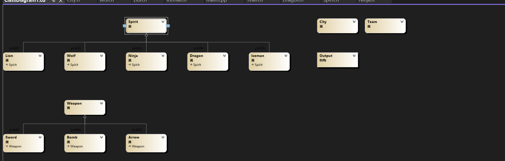
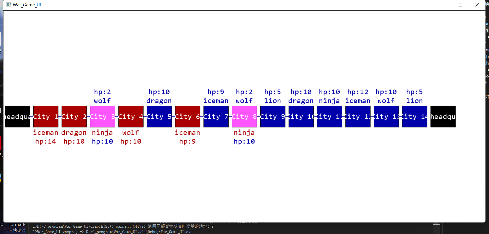
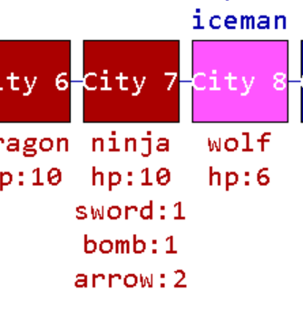
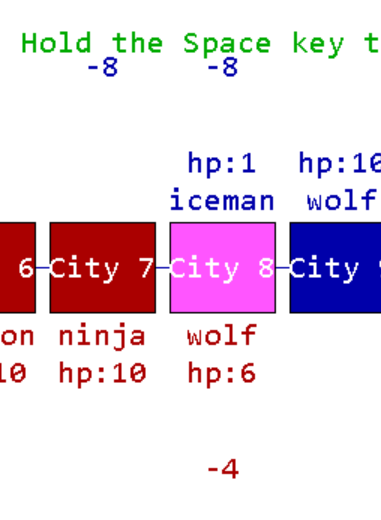

## 高级程序设计大作业——魔兽争霸程序实验报告（开发文档）

[TOC]

#### 1.目标实现

基于C++面向对象程序设计思想，设计一个根据所给信息自动运行的游戏，详细展示游戏运行过程。在此基础上有设计了简单的图形界面，直观展现游戏过程。

#### 2.已实现难度

已经实现第三难度（开战）。

#### 3.程序文件架构

有一个**main.cpp**作为主程序入口，抽象的Spirit.h封装抽象的基类Spirit类，Dragon.h 、Ninja.h、Iceman.h、lion.h、Wolf.h各自封装一个类；Weapon.h封装了所有3个武器类；City类处理所有战斗和移动事件；Team类处理司令部生成武士事件；最后添加一个draw.h文件封装绘制图形界面的函数。简单UML图如下：



#### 4.逻辑思路

##### 4.1 备战

1.根据要求，总生命元，各武士生命，攻击力是需要读入的数据，所以main函数首先读取

2.因为最大生命和初始攻击力是各个武士类的属性，所以将其定义为静态，在main函数中读取修改之

3.根据要求，需要按着固定顺序循环制造武士，故设置红蓝选取列表：

```c++
int redS[5]={2,3,4,1,0}; //红选取顺序
int blueS[5]={3,0,1,2,4}; //蓝选取顺序
int redcount=0,bluecount=0; //红蓝选取索引
```

4.在team类中：

```c++
bool generateSpirit(int timestamp,int spirit,City &city);// 如果产生成功返回true，不足返回false
void stopGenerating(int timestamp);
```

两个函数负责产生和停止制造武士；按着难度1的要求，需要所有武士都无法制造才停止，因此返回值需要进 		一步判断。

5.全局变量 T记录时间

##### 4.2 装备

1.编写Weapon.h封装了所有3个武器类

2.武士获得武器需要在Spirit类中添加函数：

```c++
Weapon* getWeapon(int n); // 根据给定编号获得武器
```

3.对于武器的储存，为了方便后面处理战斗和武器抢夺，设置一个2维数组，0号为Sword，1为bomb，2为arrow。分别存有各自武器。

```c++
vector<vector<Weapon*>> weapons;
```

##### 4.3 开战

###### 4.3.1

使用City对象数组储存各城市，通过遍历来操作武士

###### 4.3.2.武士移动

1.city对象设置红蓝两个指针

2.在遍历时我发现，对于每个队，必须从走最快的武士开始向后，将指针依次修改，这导致不能通过一次遍历修改两个队伍，因此：

```c++
// find the firts move
if(cities[i].getRed()!=NULL){
	redStart=i;
}
if(cities[i].getBlue()!=NULL && !stopped){
	blueStart=i;
	stopped=true;
}
```

然后再从找得到位置开始依次修改

3.但这样操控移动使得输出不符合要求，因此需要将输出先缓冲按要求排序再一起输出：

```c++
struct Output{ // 结构化输出信息
	int team_id;
	int city;
	string str;
};
// use stringstream to inverse the output
vector<Output> output;
ostringstream streami;
sort(output.begin(),output.end(),cmpOutPut);
```

###### 4.3.3 战斗

1.在40分调用city.fight()

2.每个武士依次调用attack：

```c++
while(isEnd<2){
    isEnd= 0;
    isEnd+= red->attack(*blue);
    isEnd+= blue->attack(*red);
}
```

返回1代表宣布结束，当双方都宣布结束，战斗结束，判断输出

3.对于attack函数最关键的是将一维武器索引转化维2维武器索引：

```c++
if(index>getWeaponNum()-1){index=0;}
int i=0,j=0;
int sum=-1;
for(int k=0;k<3;k++){
    sum+=weapons[k].size();
    if(index>sum){
        i++;
    }
    else{
        j=index-(sum-weapons[k].size()+1);
        break;
    }
}
// 得到weapons[i][j]
```

###### 4.3.4.抢夺武器

1.根据要求需先将武器排序：

```c++
bool cmp(Weapon *a, Weapon *b){
    return a->getlive()<b->getlive();
}
void Spirit::sortWeapons(){
    for(int i=0;i<3;i++){
        sort(weapons[i].begin(),weapons[i].end(),cmp);
    }
}
```

2.对于胜利抢夺武器：

```c++
void Spirit::robAll(Spirit &other){
    for(int i=0;i<3;i++){
        while(!other.weapons[i].empty()){
            if(getWeaponNum()<maxWeapon){
                weapons[i].push_back(other.weapons[i].back());
                other.weapons[i].pop_back();
            }
            else break;
        }
    }
}
```

需要抢夺3类武器，而对于wolf抢夺武器，只1类即可，只需在while结束后return即可

##### 4. 图形界面

因为需要呈现的信息多但交互性不强，我选择esayx库制作界面。

###### 4.0 关于文字显示

为了使文字对称美观，使用

```c++
drawtext(ss,&r, DT_CENTER | DT_VCENTER | DT_SINGLELINE);
```

函数居中显示，但是string都需要转为Tchar* 

###### 4.1 显示城市

城市之间用线连接，城市由颜色方块和内部名字构成。当未被占领时为黑色，被占领后展示不同颜色

###### 4.2 显示武士

红武士位于城市上方，蓝武士位于城市下方，显示其名字

###### 4.3.1 过程

最终采用了空格按键控制，按下**空格键**使游戏按一定速率自动运行如 图1。



​																				图1

###### 4.3.2 交互 and 效果

1.当鼠标放置于某个武士名称上时，在其旁边显示武器：



2.当武士受伤时调用hurt函数，产生一个伤害数字，保留并显示一段时间：


